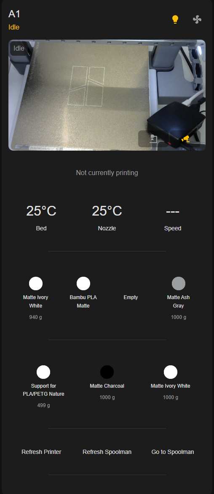
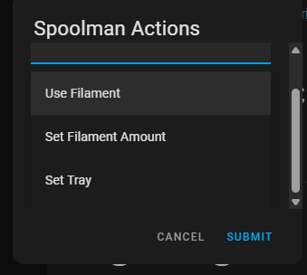

# PrintWatch Card - Spoolman

This builds up on the great work of drkpxl/printwatch-card.

Spoolman integration of printwatch-card and external camera.

- Hook an external camera to feed. Switch between internal and external.
- See the weight of every spoolman spool. Visualize used percentage of the spool.
- Use Filament, Set Filament Amount and Set Tray from the card.
- Set `spoolman_url` to the address of your Spoolman instance. The default
  `http://localhost:7912/` is a placeholder and must be overridden.

In your spoolman, you need an extra field called ams_tray. 0 means its not on ams. 1+ means its on that slot of the ams.

