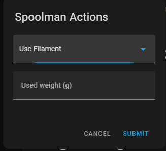

# PrintWatch Card - Spoolman

This builds up on the great work of drkpxl/printwatch-card.

Spoolman integration of printwatch-card and external camera.

- Hook an external camera to feed. Switch between internal and external.
- See the weight of every spoolman spool. Visualize used percentage of the spool.
- Use Filament, Set Filament Amount and Set Tray from the card.

In your spoolman, you need an extra field called ams_tray. 0 means its not on ams. 1+ means its on that slot of the ams.




## Installation

1. Install dependencies and build the card:
   ```bash
   npm install
   npm run build
   ```
   This generates `dist/printwatch-card.js`.

2. Copy the file to your Home Assistant `www` folder and add it as a resource:
   ```yaml
   resources:
     - url: /local/printwatch-card.js
       type: module
   ```

## Configuration

Add the card to your Lovelace dashboard. `spoolman_url` specifies the URL of your Spoolman instance and is used by the quick link button.

```yaml
type: custom:printwatch-card
printer_name: My 3D Printer
spoolman_url: http://192.168.1.50:7912/
camera_entity: image.p1s_camera
```

See [CONTRIBUTING.md](CONTRIBUTING.md) for guidelines on how to help with the project. Licensed under the [MIT License](LISCENSE).
